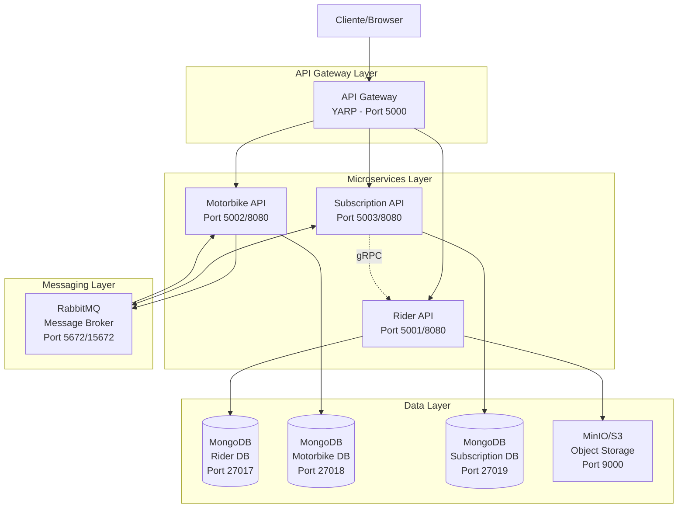
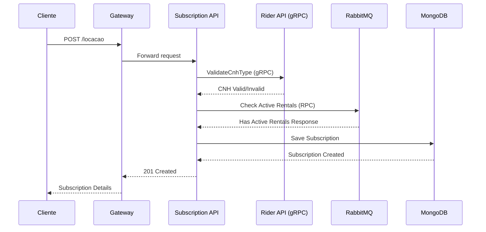
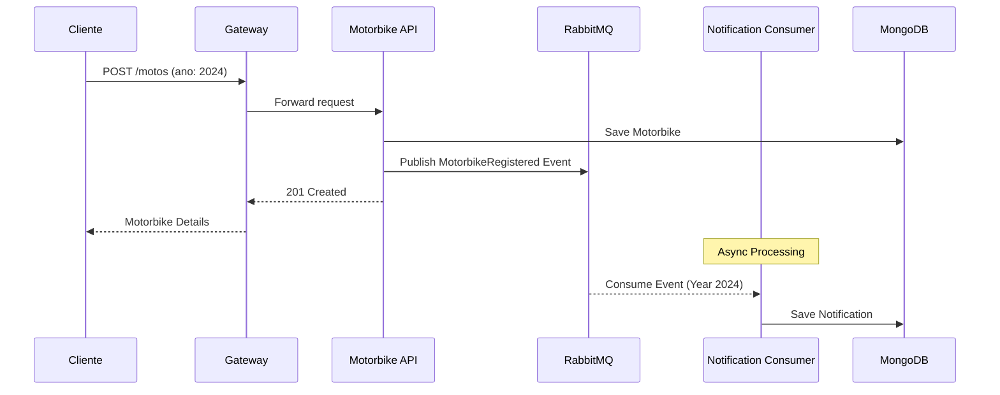

# Arquitetura do Sistema de Gerenciamento de Aluguel de Motos

## 📋 Índice

- [Visão Geral da Arquitetura](#-visão-geral-da-arquitetura)
- [Princípios Arquiteturais](#-princípios-arquiteturais)
- [Componentes da Arquitetura](#️-componentes-da-arquitetura)
- [Fluxos de Integração](#-fluxos-de-integração)
- [Estratégia de Dados](#️-estratégia-de-dados)
- [Mensageria (RabbitMQ)](#-mensageria-rabbitmq)
- [Segurança](#-segurança)
- [Monitoramento e Observabilidade](#-monitoramento-e-observabilidade)
- [Deployment](#-deployment)
- [Estado Atual da Implementação](#️-estado-atual-da-implementação)
- [Referências](#-referências)

## 📐 Visão Geral da Arquitetura

O sistema segue uma arquitetura de **microsserviços** com separação clara de responsabilidades, comunicação assíncrona via mensageria e armazenamento isolado por serviço.



## 🎯 Princípios Arquiteturais

### 1. Separação de Responsabilidades

- **Rider API**: Gestão de entregadores e documentação
- **Motorbike API**: Gestão de motos e eventos
- **Subscription API**: Gestão de locações e cálculos

### 2. Isolamento de Dados

- Cada microsserviço possui seu próprio banco de dados
- Não há compartilhamento direto de dados entre serviços
- Comunicação via API quando necessário

### 3. Comunicação Entre Serviços

- **Síncrona**: gRPC para operações críticas (validação de CNH)
- **Assíncrona**: RabbitMQ para eventos e notificações

### 4. Resilência e Escalabilidade

- Serviços independentes podem escalar individualmente
- Falha em um serviço não afeta os outros diretamente
- Circuit breaker pattern implementado nas comunicações

## 🏛️ Componentes da Arquitetura

### API Gateway (YARP)

**Responsabilidades:**

- Roteamento de requisições
- Load balancing
- Rate limiting (configurável)
- Agregação de logs
- CORS handling

**Rotas Configuradas:**

```yaml
/entregadores/* → Rider API
/motos/* → Motorbike API
/locacao/* → Subscription API
/rider/* → Rider API (prefixo removido)
/motorbike/* → Motorbike API (prefixo removido)
/subscription/* → Subscription API (prefixo removido)
```

### Microsserviços

#### Rider API

**Tecnologias:**

- ASP.NET Core 8 Web API
- MongoDB Driver
- AWS SDK for S3
- gRPC Server
- FluentValidation

**Funcionalidades:**

- CRUD de entregadores
- Validação de documentos (CNPJ/CNH)
- Upload de imagens para S3/MinIO
- Serviço gRPC para validação de habilitação

**Padrões Implementados:**

- Repository Pattern
- CQRS
- Dependency Injection
- Options Pattern para configuração

#### Motorbike API

**Tecnologias:**

- ASP.NET Core 8 Web API
- MongoDB Driver
- RabbitMQ Client
- FluentValidation

**Funcionalidades:**

- CRUD de motos
- Publicação de eventos
- Consumidor para notificações 2024
- Validação de locações ativas (RPC)

**Padrões Implementados:**

- Event-Driven Architecture
- Repository Pattern
- CQRS
- Publisher/Subscriber

#### Subscription API

**Tecnologias:**

- ASP.NET Core 8 Web API
- MongoDB Driver
- RabbitMQ Client
- gRPC Client
- FluentValidation

**Funcionalidades:**

- Gestão de locações
- Cálculo de custos e penalidades
- Validação de elegibilidade
- Consumidor RPC para consultas

**Padrões Implementados:**

- Domain Service Pattern
- Repository Pattern
- CQRS
- Request/Reply Pattern (RabbitMQ)

## 🔄 Fluxos de Integração

### Fluxo de Criação de Locação



### Fluxo de Cadastro de Moto (2024)



## 🗄️ Estratégia de Dados

### MongoDB Collections

#### Rider Database (RiderServiceDb)

```javascript
{
  "_id": ObjectId,
  "Identifier": "unique-id",
  "Name": "João Silva",
  "Cnpj": "12345678000190",
  "Birthdate": ISODate,
  "CnhNumber": "12345678901",
  "CnhType": "A",
  "CnhImageUrl": "cnh/user/12345.png",
  "Active": true,
  "CreatedAt": ISODate,
  "UpdatedAt": ISODate
}
```

#### Motorbike Database (MotorbikeServiceDb)

```javascript
// Collection: Motorbikes
{
  "_id": ObjectId,
  "Identifier": "bike-001",
  "Year": 2024,
  "Model": "Honda CG 160",
  "LicensePlate": "ABC1D23",
  "IsAvailable": true,
  "Active": true,
  "CreatedAt": ISODate,
  "UpdatedAt": ISODate
}

// Collection: MotorbikeNotifications
{
  "_id": ObjectId,
  "MotorbikeIdentifier": "bike-001",
  "Year": 2024,
  "Model": "Honda CG 160",
  "LicensePlate": "ABC1D23",
  "NotificationDate": ISODate,
  "CreatedAt": ISODate,
  "UpdatedAt": ISODate
}
```

#### Subscription Database (SubscriptionServiceDb)

```javascript
{
  "_id": ObjectId,
  "Identifier": "sub-001",
  "RiderIdentifier": "rider-001",
  "MotorbikeIdentifier": "bike-001",
  "PlanDays": 7,
  "DailyCost": 30.00,
  "StartDate": ISODate,
  "ExpectedEndDate": ISODate,
  "PredictedEndDate": ISODate,
  "ActualReturnDate": ISODate,
  "TotalCost": 210.00,
  "Status": "Active",
  "CreatedAt": ISODate,
  "UpdatedAt": ISODate
}
```

## 📨 Mensageria (RabbitMQ)

### Exchanges e Queues

#### Event-Driven Pattern

```yaml
Exchange: motorbike.events (topic)
Queue: motorbike.2024.notifications
Routing Key: motorbike.registered
Message Format: JSON
```

#### RPC Pattern

```yaml
Queue: subscription.check-active-rentals
Reply Queue: Temporary exclusive
Correlation ID: GUID
Timeout: 5 seconds
```

### Mensagens

#### MotorbikeRegisteredEvent

```json
{
  "MotorbikeIdentifier": "bike-001",
  "Year": 2024,
  "Model": "Honda CG 160",
  "LicensePlate": "ABC1D23",
  "Timestamp": "2025-01-10T10:00:00Z"
}
```

#### CheckActiveRentalsRequest/Response

```json
// Request
{
  "MotorbikeIdentifier": "bike-001"
}

// Response
{
  "HasActiveRentals": false,
  "MotorbikeIdentifier": "bike-001"
}
```

## 🔐 Segurança

### Implementado

- Validação de entrada (FluentValidation)
- Sanitização de dados
- Logging básico (Console via ILogger)
- Timeouts em comunicações externas (5 segundos para gRPC e RabbitMQ RPC)

## 📊 Monitoramento e Observabilidade

### Estado Atual

- **Logs**: Console logging via ILogger
- **Formato**: Texto simples
- **Níveis**: Information, Warning, Error
- **Destino**: Console (stdout)
- **Serilog**: Presente como dependência mas não configurado
- **CloudWatch**: Não implementado

### Logs Implementados nos Serviços

- Logs de informação para operações bem-sucedidas
- Logs de warning para validações falhas
- Logs de erro para exceções
- Correlação manual via parâmetros nos logs

## 🚀 Deployment

### Ambiente de Desenvolvimento (Docker Compose)

```yaml
services:
  gateway: Porta 5000
  rider: Portas 5001 (dev), 8080/8081 (container)
  motorbike: Portas 5002 (dev), 8080 (container)
  subscription: Portas 5003 (dev), 8080 (container)
  rider-database: Porta 27017
  motorbike-database: Porta 27018
  subscription-database: Porta 27019
  rabbitmq: Portas 5672 (AMQP), 15672 (Management)
  rider-storage: Portas 9000 (API), 9001 (Console)
```

### Configuração de Containers

- **Base Image**: mcr.microsoft.com/dotnet/aspnet:8.0
- **Build Image**: mcr.microsoft.com/dotnet/sdk:8.0
- **User**: app (non-root)
- **Workdir**: /app
- **Network**: bridge mode com redes isoladas

## ⚠️ Estado Atual da Implementação

### ✅ O que está Implementado

1. **3 Microsserviços funcionais** - Rider, Motorbike, Subscription
2. **API Gateway com YARP** - Roteamento e proxy reverso
3. **MongoDB isolado por serviço** - 3 instâncias independentes
4. **RabbitMQ** - Mensageria para eventos e RPC
5. **MinIO** - Storage S3-compatible para imagens
6. **gRPC** - Comunicação síncrona entre Subscription e Rider
7. **CQRS Pattern** - Separação de comandos e queries
8. **Repository Pattern** - Abstração de acesso a dados
9. **FluentValidation** - Validação de entrada
10. **AutoMapper** - Mapeamento de objetos
11. **Docker Compose** - Orquestração local
12. **API Versioning** - Versionamento de endpoints

### 📊 Comparação com Arquitetura de Referência

| Componente         | Arquitetura Referência | Implementação Atual         | Status           |
| ------------------ | ---------------------- | --------------------------- | ---------------- |
| API Gateway        | Amazon API Gateway     | YARP                        | ✅ Implementado  |
| Containers         | ECS/Fargate            | Docker/Compose              | ✅ Implementado  |
| Database           | MongoDB Atlas          | MongoDB Local               | ✅ Implementado  |
| Storage            | Amazon S3              | MinIO                       | ✅ Implementado  |
| Message Broker     | Amazon MQ              | RabbitMQ                    | ✅ Implementado  |
| Monitoring         | CloudWatch             | Console logging             | ⚠️ Básico        |
| Structured Logging | Serilog                | Dependência não configurada | ❌ Não utilizado |

## 📚 Referências

### Documentação do Projeto

- **README Principal**: [README.md](../Source/README.md)
- **Especificação Original**: [README.md](../README.md)
- **Estrutura de Código**: [Challenge.sln](../Source/Challenge.sln)

### Documentação Externa

- [Microservices.io](https://microservices.io/)
- [.NET Microservices Architecture](https://docs.microsoft.com/en-us/dotnet/architecture/microservices/)
- [MongoDB Best Practices](https://www.mongodb.com/docs/manual/administration/production-notes/)
- [RabbitMQ Patterns](https://www.rabbitmq.com/getstarted.html)
- [YARP Documentation](https://microsoft.github.io/reverse-proxy/)
